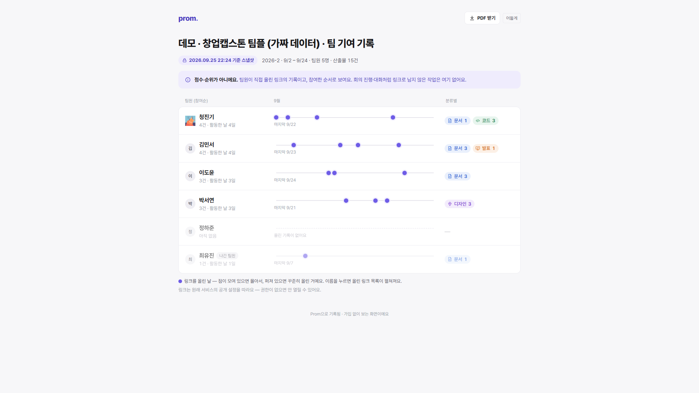

# Prom — 팀 프로젝트 기여 기록

> 팀플 산출물 링크를 붙여넣기만 하면 모이고, 학기말에 버튼 하나로 기여 리포트가 나와요.

👉 **서비스:** https://logone-3f9ca.web.app
👉 **예시 리포트 (가입 없이 열림):** https://logone-3f9ca.web.app/share/demo-prom-001/demoPromReport2026aaaaaa

## 어떻게 쓰나

1. **붙여넣기** — 노션·피그마·깃허브·구글 문서 링크를 대시보드에 붙여넣으면 제목·분류가 자동으로 잡혀요. 한 번에 10초.
2. **쌓이기** — 누가 언제 무엇을 올렸는지 팀 전체에 실시간으로 보여요.
3. **리포트** — 학기말에 팀원별 기록을 공유 링크나 PDF로. 교수님은 가입 없이 바로 열어요.

## 일부러 안 만든 것

| | |
|---|---|
| 점수·순위 | 링크를 많이 붙인 사람이 이기는 구조면 평가에 못 써요. 「누가 무엇을 올렸나」만 보여줘요 |
| 빨간 경고 | 아직 못 올린 사람은 흐리게만. 감시 도구가 아니라 기록 도구예요 |
| 드라이브 자동 긁기 | 링크 주소만 저장해요. 파일 내용은 읽지 않아요 |

## 깃허브 링크는 한 번 더 확인해요

공개 저장소 링크를 올리면, 보는 사람의 브라우저가 GitHub에 직접 물어서 **진짜 제목·작성자·날짜**를 보여줘요
(「✓ GitHub · @계정」). 이 저장소가 그 시연용이에요 — 이 저장소의 커밋·이슈·PR 링크를 Prom에 붙여보세요.

---

팀 로그원 · 명지전문대학 창업캡스톤디자인 2026
